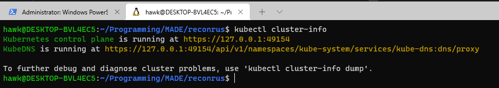
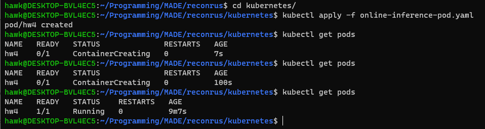

1) Установил minikube в соответствии с [этой ссылкой](https://minikube.sigs.k8s.io/docs/start/) на Ubuntu 20.04 (WSL2). Результат ``kubectl cluster-info``:

\+5 баллов

2) Написал pod manifest ``online-inference-pod.yaml``, задеплоил: 
    \+4 балла

    a) +2 балла
    * Requests - минимальные ресурсы, которые должны быть выделены контейнеру. Благодаря этим параметрам, scheduler определяет, на какой ноде запустить под. 
    * Limits - максимальные ресурсы, которые могут быть выделены контейнеру. К примеру, коль контейнер попытается получить больше RAM'ки, чем позволяют limits, контейнер убивается.

3) 0 баллов

4) При изменении количества реплик, смены докер образа в манифесте и реконфигурации replicaset через ``kubectl apply -f online-inference-replicaset.yaml``   
а) при уменьшении кол-ва реплик - просто удаляется часть подов со старым докер образом, а часть таких подов остаётся  
б) при увеличении кол-ва реплик - добавляются недостающие реплики с новым образом, в то время как уже существующие никуда не деваются.  
\+3 балла

Итого: 14 баллов